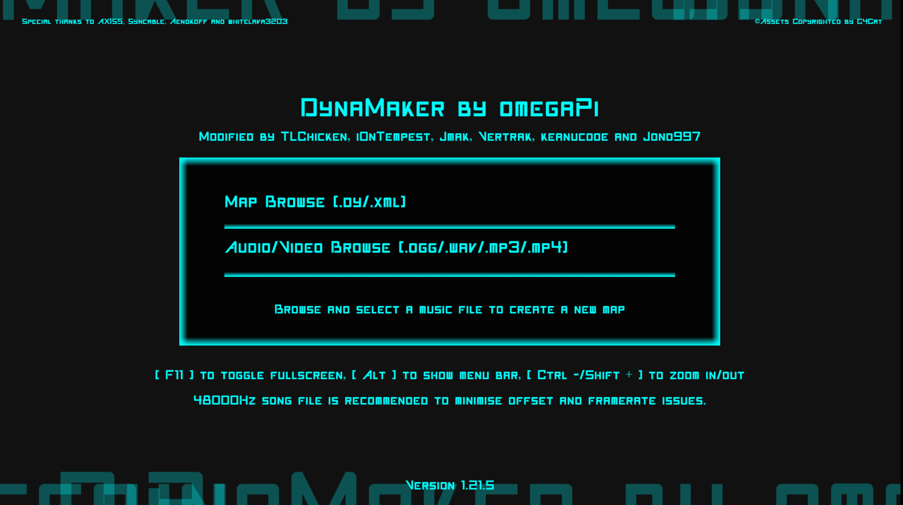
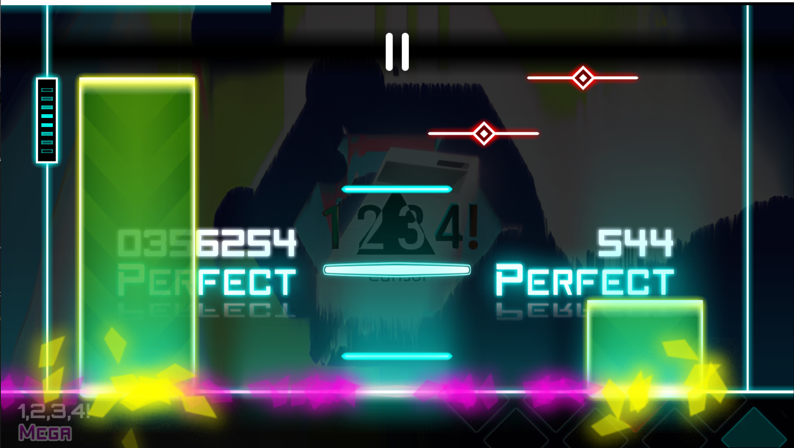
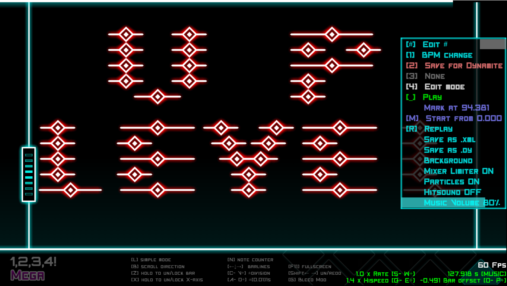

<h1 align="center">DynaMaker</h1>

A charting tool for creating charts for Dynamix and Dynamite, originally created by omegaPi. </b>

Latest version: <a href="https://github.com/jmakxd/dynamaker-modified/releases">1.21.5</a></b>

這是DynaMaker的修改版本，允許用戶使用更多功能為Dynamite創建自製譜面（由omegaPi創建）。

該版本與Electron以及其他JavaScript編碼打包

_你目前看到的版本是由 NagaseIori 从原 Repo 中 Fork 而来并用 Github Pages 进行分发的版本，这省去了一些下载的步骤。该版本自原 Repo 未经过任何其他的修改。_

_访问 Dynamaker 工具请前往[此处](https://dym.iorinn.moe/app/src)_ 。

<h1 align="center">Supported Platforms 支援平台</h1>
Windows (64-bit), macOS (64-bit), Linux (Run Source Code with console or terminal)
 Windows(64位元), macOS(64位元), Linux(使用控制檯或終端運行源代碼)

<h1 align="center">Use on Browser 在瀏覽器使用</h1>
Web version - thanks to NagaseIori
 English 英語：https://dym.iorinn.moe/en/src/
 Chinese (Traditional)繁體中文：https://dym.iorinn.moe/zh/src/
 Chinese (Simplified) 简体中文：https://dym.iorinn.moe/cn/src/

<h1 align="center">Download in China 在國內下載</h1>
https://share.weiyun.com/rYpdklN2

<h1 align="center">Creators 創作者</h1>
Jmak, TLChicken, Vertrak, keanucode, Jono997, AXIS5, i0nTempest
 Icon by Aenokoff
 BPM change function created by whitelava3203
 Program originally created by omegaPi

<h1 align="center">Screenshots 截圖</h1>

<h1 align="center">Special Thanks 特別鳴謝</h1>
Syncable, 錫爾/Sylvex, Aploplex, 天堂EGHD, AXIS5, Aenokoff

<h1 align="center">Copyright Disclaimer 版權聲明</h1>
All assets used in DynaMaker are borrowed from Dynamix, created by C4Cat Entertainment Limited.
 DynaMaker使用的所有資源是由C4Cat Entertainment Limited創建的Dynamix（炫光動感）借用的。
 DynaMaker Website Version 網頁版: https://dynamaker.tunergames.com/

<h1 align="center">Failed Experiments 失敗實驗</h1>
Lane Flash - Hold and sub notes can't be detected properly
 Auto re-scaling - Mouse is out of canvas if re-scaled
 First launch zoom - 100% fullscreen is no longer possible (doesn't fit the whole screen)
 Hold particles frequency - Hardcoded